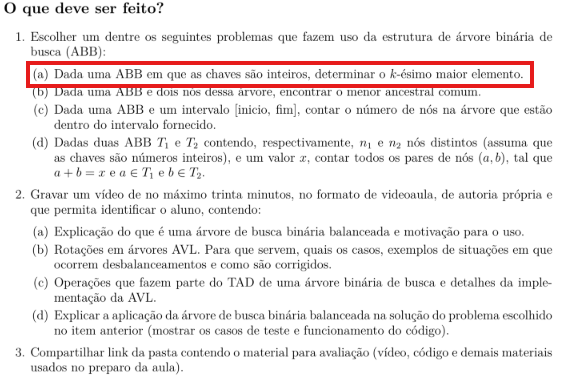
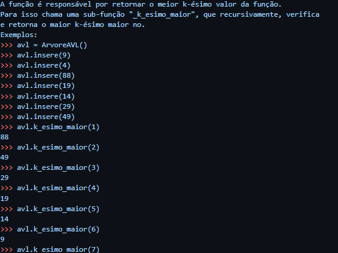

# school-work
Este Trabalho foi realizado durante a diciplina de Esturuta de Dados

CONTEXTUALIZAÇÃO
Uma árvore binária é uma estrutura de dados hierárquica, composta por um conjunto de elementos chamados nós. O que a torna "binária" é a regra fundamental de que cada nó pode ter, no máximo, dois filhos: um filho à esquerda e um filho à direita.

Exemplo de uma arvore binária, para exemplificação. 

TRABALHO //////////////////////

Para este trabalho devemos implementar uma arvore binária de busca balanceada (ARVORE AVL), e escolher um dentre os  problemas que fazem uso da estrutura de árvore binária de
busca (ABB):

PROBLEMA A RESOLVER :
- Este código Python implementa uma Árvore AVL, que é um tipo de árvore de busca binária auto-balanceável. O principal objetivo de uma Árvore AVL é garantir que a diferença de altura entre as subárvores esquerda e direita de qualquer nó seja no máximo 1. Isso é crucial para manter a eficiência das operações de busca, inserção e remoção, que, de outra forma, poderiam se degradar para o pior caso de O(n) em uma árvore de busca binária não balanceada.
- Ditor isso, aplicaremos oque é pedidio no trabalho : 

O problema que escolheremos está circulado em vermelho.

Caso deseje, em codigo.py, tera acesso ao código implementado e documentado. 